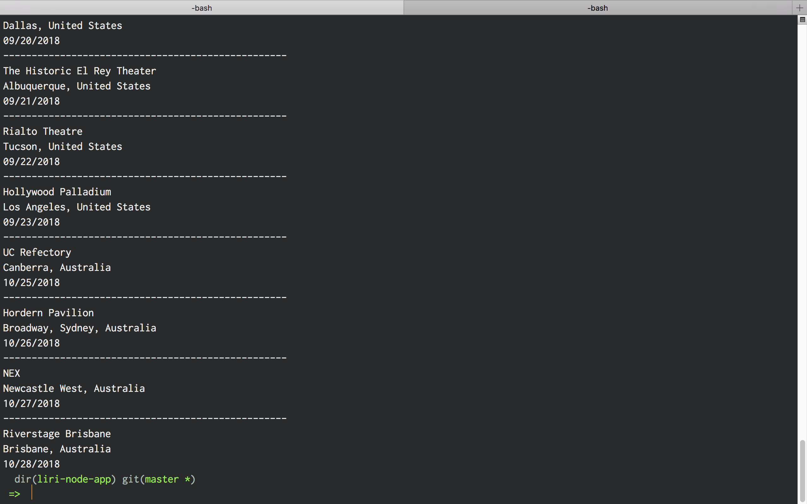

# Liri Node App

A NodeJS command-line application that will fetch data from an API depending on media type specified.

## Use

To use the Liri Node App, run:

```bash
node liri.js
```

You will then be asked what you would like to do:

* Concert This
* Spotify This Song
* Movie This
* Do What It Says

### Screen Shots

#### Concert This




#### Spotify This Song


#### Movie This


#### Do What It Says


